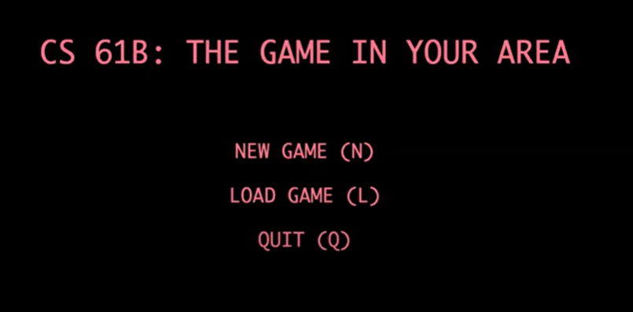
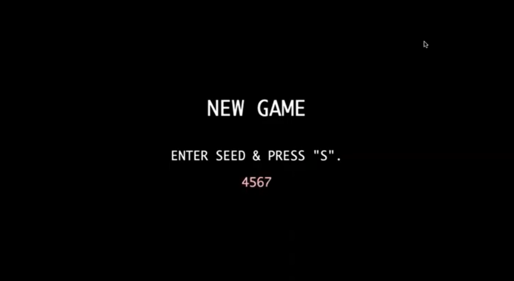
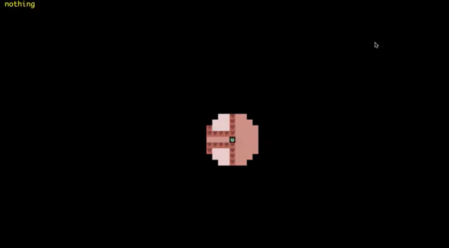
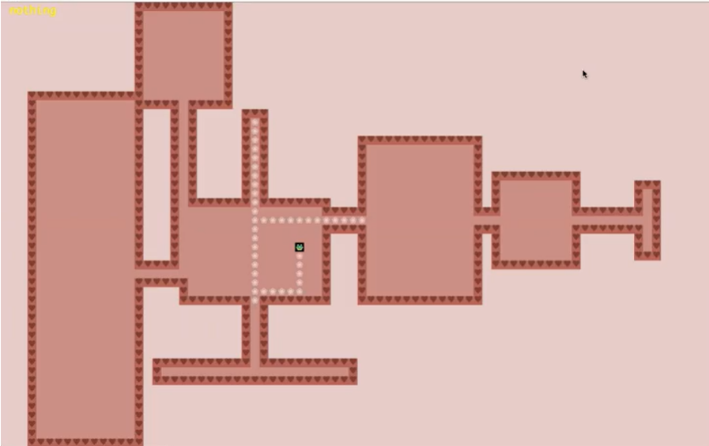

# What is Frog 🐸?

⚡Frog is a 2D Roguelike exploration game developed in Java that allows the player to explore the world and win by completing mini-games, spawned automatically after the player encounters a crucial game item. The game uses the StdDraw library to enable graphics and other front-end components. 

🚀 In this game, the player will embark on a fun adventure, solve challenging puzzles, and explore a vast world filled with surprises!

[](https://opensource.org/licenses/BSD-3-Clause)
---

## Table of Contents

- [Game Features](#game-features)
- [Getting Started](#getting-started)
- [License](#license)
- [Contact](#contact)

---

## **Game Features**

The Main Menu should be fully navigable via the keyboard, using N for “New Game”, L for “Load Game”, and Q for "Quit". 

<div align="center">


</div>

After pressing N on the keyboard for “New Game”, the player  should be prompted to enter a “Random Seed".

<div align="center">


</div>

After the player has entered a Seed and pressed S, the world should be displayed with a user interface. The player can move around freely using the keyboard. There is a “Heads Up Display” (HUD) that provides additional information that maybe useful to the player. It describes the tile currently under the mouse pointer.

<div align="center">


  
</div>

### **Special Effects**

I developed a feature wherein the tile renderer only displays tiles on the screen that are within the line of sight of the player. The line of sight can be toggled on and off by pressing "O" for "On" and "P" for "Off". 

#### Darkmode

<div align="center">


</div>

#### Lightmode
<div align="center">


</div>

### **Saving and Loading**

Sometimes, the player'll be exploring the world, and suddenly notice that it’s time to go to watch a lecture. For times like these, being able to save progress and load it later, is very handy. My game has a save feature "S" that saves the world while exploring, as well as, a load feature "L" that subsequently loads the world into the exact state it was in when last saved. 

The player can also choose to terminate game by pressing ":Q". 

---

## **Getting Started**

### Setting Up Java Libraries

1. Clone the following repository:
```
git clone https://github.com/Berkeley-CS61B/library-sp23
```
### Installing IntelliJ
1. Download the Community Edition of IntelliJ from the JetBrains website. It is recommended and assumed that you proceed with the Community Edition.
2. After selecting the appropriate version for your OS, click download and wait a few minutes for the file to finish downloading.
3. Run the installer.

### Installing Plugins
1. Open IntelliJ. In the Welcome window, click the “**Plugins**” button in the menu on the left.
2. On the window that appears, click “Marketplace” and enter “CS 61B” in the search bar at the top. The CS 61B plugin entry should appear.
3. Click the green **Install** button, and wait for the plugin to download and install.
4. Now, search for “Java Visualizer”, and click the green **Install** button to install the plugin.
5. Restart (close and reopen) IntelliJ.

### Starting the Game ✨
1. Your program will be started by running the <code>main</code> method of the <code>Main</code> class. 
2. Enjoy!!!

---
## **License**

This project is licensed under the BSD 3-Clause License. 

--- 

## **Contact**

For more information, feel free to contact me at trangnguyen12002@berkeley.edu :frog::rocket:

